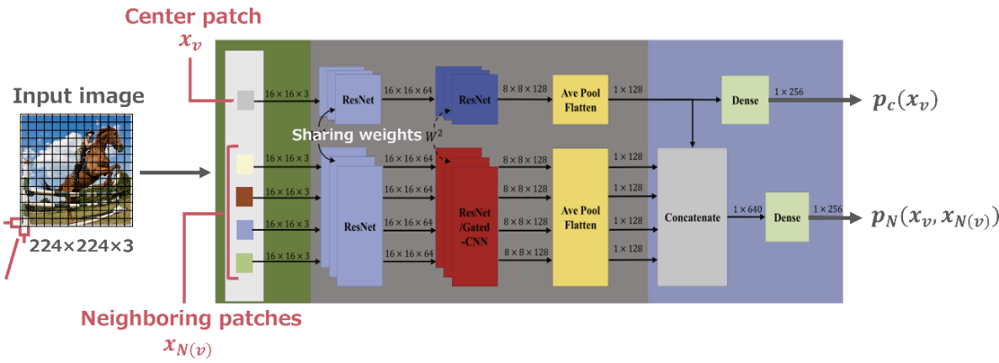

# Gated CNN
This code was created by referencing the paper titled ["Gated CNN for visual quality assessment based on color perception"](https://www.sciencedirect.com/science/article/abs/pii/S0923596518311500), which was written by [**Peng Lu**, **Xujun Peng**, **jinBei Yu**, **Xiang Peng**].

| Structure of the GatedCNN model |
| :--: |
|  |

## Requirements
It was implemented in `Pytorch`.

## Getting Started
```
python train.py
```
Please modify the arguments in the parser of train.py as needed.
Note that it requires a lot of memory.

## If you use Docker
1. Navigate to the docker directory where the Dockerfile is located, and build your Docker image with the following command:
```
docker build -t gated-cnn:ver1 .
```
`gated-cnn:ver1` is the name of the Docker image you are creating. This can be changed as needed.

2. Next, run your Docker container using the following command:
```
docker run --name GatedCNN_ver1 --gpus all -it --shm-size 2gb -v </path/to/your/GatedCNN/src>:/home/GatedCNN/src gated-cnn:ver1
```
In this command, `</path/to/your/GatedCNN/src>` should be replaced with the path to the project source code on your local system.
`GatedCNN_ver1` is the name of the Docker container you are creating. This can be changed as needed. `--gpus all` option allows the Docker container to access all GPUs, if you are using GPU(s). `--shm-size 2gb` option increases the shared memory size available to the Docker container to 2GB, which can be useful for certain applications that require a large amount of shared memory. `gated-cnn:ver1` is the name of the Docker image you built earlier. 
