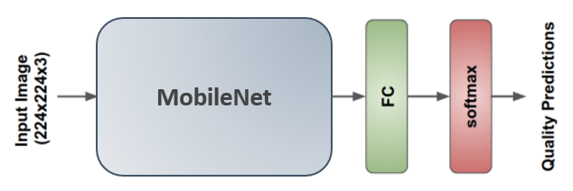

# Image Quality Assessment

This project uses code from ["Nima: Neural Image Assessment"](https://arxiv.org/pdf/1709.05424.pdf) by [**H. Talebi and P. Milanfar**].

| Structure of the NIMA model |
| :--: |
|  |

## Requirements
It is implemented in `Tensorflow2.0`.

## Getting Started
I will describe how to run soon. Please check [original repository](https://arxiv.org/pdf/1709.05424.pdf).
