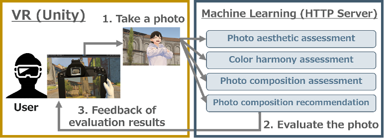
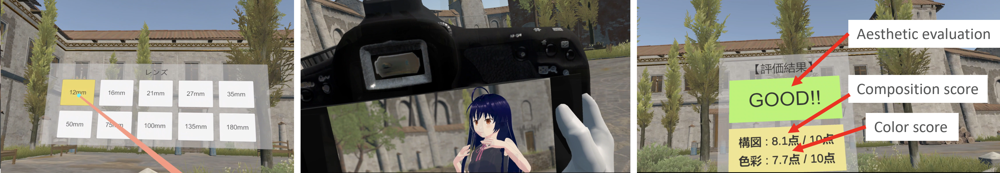

# VR Photo Training System
In this repository, we provide information that contributed to the creation of the VR Photo Training System. This includes the machine learning models we used, the datasets we created, and the annotation system we developed.
| System diagram |
| :--: |
|  |

We utilize the following four machine learning models for evaluating and recommending photographs.

1. NIMA model (["NIMA: Neural Image Assessment"](https://arxiv.org/pdf/1709.05424.pdf))
2. Gated CNN model (["Gated CNN for visual quality assessment based on color perception"](https://www.sciencedirect.com/science/article/abs/pii/S0923596518311500))
3. VEN model (["Good View Hunting: Learning Photo Composition from Dense View Pairs"](https://openaccess.thecvf.com/content_cvpr_2018/papers/Wei_Good_View_Hunting_CVPR_2018_paper.pdf))
4. VPN model (["Good View Hunting: Learning Photo Composition from Dense View Pairs"](https://openaccess.thecvf.com/content_cvpr_2018/papers/Wei_Good_View_Hunting_CVPR_2018_paper.pdf))

## Datasets
In this study, we created three datasets to realize the evaluation of photographs in a VR environment:

1. **VR Photo Aesthetic Dataset** is used to fine-tune the **NIMA** model ([Download Data from Google Drive](https://drive.google.com/file/d/1mmVNCm24O6ypI9nVckel-a5KCQrQAlzf/view?usp=sharing))
2. **VR Photo Composition Dataset** is used to fine-tune the **VEN** and **VPN** models ([Download Data from Google Drive](https://drive.google.com/file/d/1crno5FIxjSUcSsFY5q3x_gfYPPLBDGIa/view?usp=sharing))
3. **VR Photo Color Dataset** is used to train the **Gated CNN** models ([Download Data from Google Drive](https://drive.google.com/file/d/1vO75f4VtgnXb2a0QrWBolMi__s832MpH/view?usp=sharing))

Also, we use three existing datasets:

1. **AVA Dataset** is used to pre-train the **NIMA** model ([Data](https://github.com/imfing/ava_downloader))
2. **CPC Dataset** is used to pre-train the **VEN** and **VPN** models ([Data](https://www3.cs.stonybrook.edu/~cvl/projects/wei2018goods/VPN_CVPR2018s.html))
3. **FLMS Dataset** is used to evaluate the **VEN** and **VPN** models ([Data](http://fangchen.org/proj_page/FLMS_mm14/data/radomir500_image/image.tar), [Annotation](http://fangchen.org/proj_page/FLMS_mm14/data/radomir500_gt/release_data.tar))

## How to utilize this system
| Illustrations of using the VR Photo Training System
| :--:
| 

Firstly, use the VR controller to select camera parameters such as aperture value and lens focal length from a panel within the VR interface (left image). After parameter selection, manipulate the virtual camera using the VR controller to take a photo of the subject (center image). Select the captured photo from the virtual album for it to be automatically evaluated (right image). If required, a sample image demonstrating a more optimal composition will be presented.
