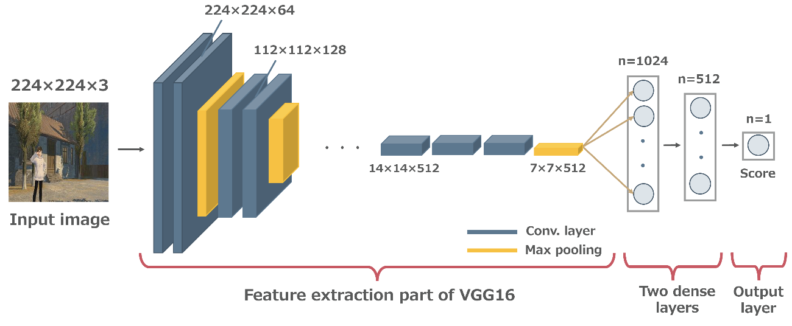

# View Evaluation Net
This project uses code from ["Good View Hunting: Learning Photo Composition from Dense View Pairs"](https://github.com/zijunwei/ViewEvaluationNet/tree/master) by [**Zijun Wei**].

The original project did not include files for training the model, therefore I created them. 

| Structure of the VEN model |
| :--: |
|  |

## Requirements
Just like the original project, it is implemented in `PyTorch`.

## Getting Started
```
python train.py
```
However, please modify the arguments in the parser of train.py as needed.

## If you use Docker
1. Navigate to the docker directory where the Dockerfile is located, and build your Docker image with the following command:
```
docker build -t pytorch:ver1 .
```
`pytorch:ver1` is the name of the Docker image you are creating. This can be changed as needed.

2. Next, run your Docker container using the following command:
```
docker run --name VEN_ver1 --gpus all -it -v </path/to/your/ViewEvaluationNet/src>:/home/VEN/src pytorch:ver1
```
In this command, `</path/to/your/ViewEvaluationNet/src>` should be replaced with the path to the project source code on your local system.
`VEN_ver1` is the name of the Docker container you are creating. This can be changed as needed. `pytorch:ver1` is the name of the Docker image you built earlier. `--gpus all` option allows the Docker container to access all GPUs, if you are using GPU(s).
