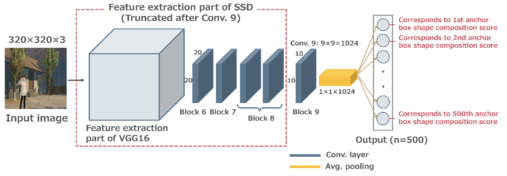

# View Proposal Net
This project takes reference from the code of ["Good View Hunting: Learning Photo Composition from Dense View Pairs"](https://github.com/zijunwei/ViewProposalNet) by [**Zijun Wei**].

The original project was implemented in `Tensorflow 1.3`. However, since `Tensorflow 1.x` is an earlier version, I implemented it in `PyTorch` to match the VEN code. Also, the original project did not include files to train the model, therefore I created them.

| Structure of the VPN model |
| :--: |
|  |

## Requirements
It is implemented in `PyTorch`.

## Getting Started
```
python train.py
```
Please modify the arguments in the parser of train.py as needed.

## If you use Docker
1. Navigate to the docker directory where the Dockerfile is located, and build your Docker image with the following command:
```
docker build -t vpn:ver1 .
```
`vpn:ver1` is the name of the Docker image you are creating. This can be changed as needed.

2. Next, run your Docker container using the following command:
```
docker run --name VPN_ver1 --gpus all -it -v </path/to/your/ViewProposalNet/src>:/home/VPN/src vpn:ver1
```
In this command, `</path/to/your/ViewProposalNet/src>` should be replaced with the path to the project source code on your local system.
`VPN_ver1` is the name of the Docker container you are creating. This can be changed as needed. `vpn:ver1` is the name of the Docker image you built earlier. `--gpus all` option allows the Docker container to access all GPUs, if you are using GPU(s).
